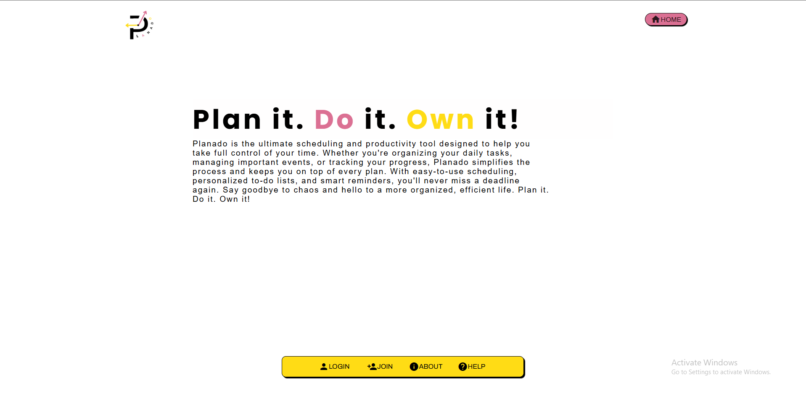

🗓️
PLANADO is a comprehensive schedule management system crafted specifically to address the unique needs of educational institutions. Schools often face challenges in releasing accurate and timely schedules, leading to confusion, delays, and inefficient communication between faculty, staff, and students. PLANADO was designed with these problems in mind — to provide a reliable, efficient, and user-friendly platform that accelerates schedule management while ensuring accuracy and coherence.

📌 Introduction
this system streamlines the entire scheduling workflow, from creation to release, allowing schools to prevent delays and reduce administrative workload. By automating many of the manual processes traditionally associated with scheduling, PLANADO empowers institutions to focus on what truly matters — delivering quality education.

🚀 Core Features and Capabilities

🔄 Dynamic Compilation System
-One of PLANADO’s standout features is its dynamic compilation system. This means that schedules are not static or isolated entities; rather, they are interconnected. When a new schedule entry is added or modified, PLANADO intelligently checks for any conflicts or dependencies with existing schedules and updates them accordingly. This eliminates errors caused by overlapping schedules or outdated data, ensuring that every user always accesses the most current information.

🤖 Interactive Bot Assistance
-Understanding that users may have questions or need guidance while navigating the platform, PLANADO integrates a simple yet effective chatbot on the landing page. This bot can respond to common inquiries, provide quick instructions, and help users troubleshoot minor issues without the need for human intervention, thus improving accessibility and user satisfaction.

🔍 Efficient Search Functionality
-Searching through large volumes of schedule data can be cumbersome. PLANADO addresses this with a robust search bar feature that enables users to find specific schedules📅, instructors👨‍🏫, classrooms🏫, or subjects🧠 quickly and effortlessly. This functionality significantly reduces the time spent looking for information and helps users get straight to what they need.

🖨️ PDF Export and Printing
-Recognizing the importance of offline access and physical copies, PLANADO supports exporting schedules as PDF files. This feature allows users to print schedules for personal use, distribute them during meetings, or archive them for record-keeping purposes. The PDFs are formatted for clarity and ease of reading.

🎨 User-Centric Design
-PLANADO is developed with the user in mind. The interface is clean, intuitive, and easy to navigate, requiring minimal training for new users. Whether you are an administrator, faculty member, or student, you will find the system straightforward and responsive.

🔐 Secure and Reliable Data Management
-Security is paramount in any information system. PLANADO incorporates secure authentication methods and robust data management protocols to protect sensitive user information and schedule data. Regular backups and validation ensure data integrity and availability.

📈 Customizability and Scalability
-Every educational institution is unique, with its own scheduling needs and policies. PLANADO is built to be flexible and customizable, allowing schools to tailor the system to their specific requirements. Additionally, the platform is scalable, capable of handling the scheduling demands of small schools to large universities.

By adopting PLANADO, schools can expect to see significant improvements in schedule management efficiency, reduced administrative burden, and enhanced communication among faculty and students. The dynamic updating feature minimizes errors, while the interactive bot and search tools improve user engagement and satisfaction.

Moreover, the ability to generate PDF schedules ensures that information is accessible both online and offline, meeting diverse user preferences. PLANADO’s secure environment protects data privacy while maintaining ease of access for authorized personnel.

💡 Why Choose PLANADO?
✅ Prevent schedule conflicts automatically
✅ Empower staff and students with up-to-date info
✅ Simplify support with bot assistance
✅ Search, print, and manage with ease
✅ Keep everything secure and customizable
